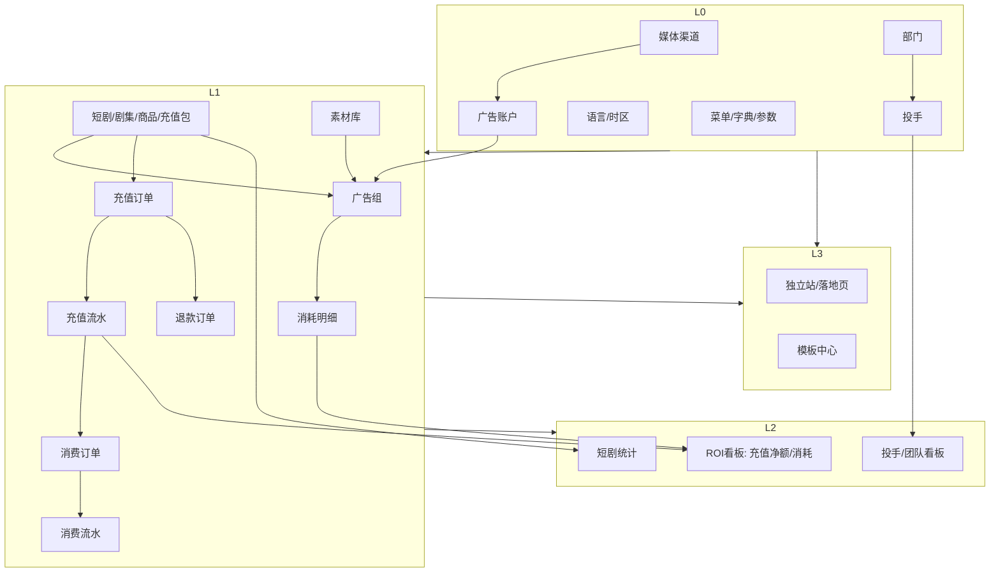

# 前端接入后端接口分阶段规划方案

> 编制日期：2026-07-02
> 依据：`2026-7-2-requirement.md` 要求按"依赖链 + 数据流 + 可用性"分阶段，不按页面平均铺开

---

## 一、现状盘点

### 1.1 后端已实现（可直接接入）

| 模块 | Controller | 端点 | 数据表 |
|---|---|---|---|
| 管理员认证 | `AdminAuthController` | login / refresh / logout / me / password/change | `admin_users` `admin_sessions` |
| 用户与权限 | `AdminUserController` | roles / admin-users CRUD / 状态 / 角色授予撤销 / 密码重置 | `admin_roles` `admin_user_roles` |
| 审计日志 | `AdminAuditController` | logs（分页+过滤）/ filter-options | `admin_audit_logs` |
| TikTok OAuth | `TikTokOAuthController` | auth-url / callback | `tiktok_auth` |

**共享基础设施**：`ApiResponse<T>` / `PageResponse<T>` / `apiClient`（axios + 401 自动刷新）/ `AdminAuditService`（操作留痕）/ Spring Security + JWT / MyBatis。

### 1.2 前端已接入后端（无需重做）

- `LoginView` / `AuthRbacView` / `AuditView`（审计日志）
- `OperationLogView` / `LoginLogView`（复用审计接口，已接入）
- `TikTokCallbackView`

### 1.3 前端待接入（当前走 mock，共 47 个业务 view）

| 业务域 | view 数 | mock 来源 |
|---|---|---|
| 投放系统 | 17 | `mock/delivery.ts` |
| 短剧内容 | 4 | `mock/drama.ts` |
| 素材库 | 2 | `mock/material.ts` |
| 独立站管理 | 6 | `mock/site.ts` |
| 订单管理 | 5 | `mock/order.ts` |
| 系统管理（角色/部门/菜单/字典/参数） | 5 | `mock/system.ts` |
| 基础配置（媒体/语言/时区/广告账户） | 4 | `mock/system.ts` |

### 1.4 后端完全缺失的领域

投放、短剧、素材、独立站、订单、系统管理（角色/部门/菜单/字典/参数）、基础配置——**零实现**。TikTok OAuth 仅完成授权握手，未实现广告账户/投放数据拉取。

---

## 二、分阶段接入总原则

后端接入按四层推进，**前一层未稳不进下一层**：

```
Layer 0  基础依赖层   →  Layer 1  核心业务流   →  Layer 2  分析聚合层   →  Layer 3  管理扩展层
```

每层交付物：
- DB migration（表结构）
- Model / Mapper / Service / Controller
- 前端 `src/api/<module>.ts` 替换对应 mock
- 审计埋点（复用 `AdminAuditService.audit(...)`）
- 权限注解（`@PreAuthorize`）

---

## 三、Layer 0：基础依赖层（前置地基）

**目标**：建立所有业务模块共享的主数据，避免后续反复改表。

### 0.1 媒体渠道 `media_channels`
- 字段：id / code(TikTok/Facebook/Google...) / name / region / currency / status
- 必须先于"广告账户""投放数据"完成
- 前端：`basic/media-channel` 接入

### 0.2 语言 `languages` + 时区 `timezones`
- 纯字典表，国际化与报表时区基准
- 前端：`basic/language` `basic/timezone` 接入

### 0.3 部门 `depts` + 角色 `roles`（角色已隐式存在）
- 部门树形结构，是"投手看板""组员消耗"按团队聚合的前提
- 前端：`system/dept` 接入；`system/role` 接入（角色表已有，补 CRUD 端点）

### 0.4 菜单 `menus` + 字典 `dicts` + 参数 `params`
- 菜单驱动权限，字典/参数支持业务配置
- 前端：`system/menu` `system/dict` `system/param` 接入

**交付标准**：本层完成后，"基础配置"与"系统管理"两组菜单全部走真实接口，且为 Layer 1 提供外键依赖。

---

## 四、Layer 1：核心业务流（投放主线）

**目标**：打通"广告账户 → 短剧 → 素材 → 广告组 → 充值订单 → 充值流水 → 消费订单 → 消费流水 → 消耗明细"的资金与数据闭环。这是 ROI 计算的命脉，**模型一旦定稿不可反复推翻**。

**实际开发顺序**（按依赖链，不按菜单分组）：

```
1. 广告账户      （依赖 Layer 0 媒体渠道）
2. 短剧/剧集/商品/充值包   （业务对象，独立于账户）
3. 素材库        （独立，但广告组要引用）
4. 广告组/投放计划    （依赖账户+短剧+素材）
5. 充值订单 + 充值流水   （入账侧：用户买金币，余额+）
6. 消费订单 + 消费流水   （出账侧：用户花余额解锁，余额-）
7. 退款订单 + 退款流水   （逆向：从充值订单退款）
8. 消耗明细      （成本侧：广告组每日/每小时消耗写入）
```

### 1.1 广告账户（投放主体，根节点）
- 表：`ad_accounts`（账户号/渠道/余额/负责人/部门/状态）
- 与 `media_channels` 多对一，与 `admin_users`（负责人）多对一，与 `depts` 多对一
- 前端接入：`basic/ad-account` `delivery/account-list` `delivery/account-detail`

**TikTok 账户联动**：`tiktok_auth` 表已有，需扩展拉取账户余额/消耗的同步任务（定时任务）。

### 1.2 短剧内容（投放对象）
- 表：`dramas`（短剧主表：分类/集数/状态/播放量/充值累计/消耗累计/ROI快照）
- 表：`drama_episodes`（剧集：标题/时长/解锁条件/播放/转化）
- 表：`drama_products`（商品库：SKU/价格/库存/销量）
- 表：`drama_recharge_packages`（充值包：价格/币数/赠品）—— **充值订单引用此表**
- 前端接入：`drama/management` `drama/detail` `drama/product-library` `drama/product-detail`

**关键决策点**：短剧 ID 与充值包 ID 是后续订单的外键来源，必须先定。

### 1.3 素材库
- 表：`materials`（素材主表：名称/类型/文件/标签/状态）
- 表：`material_adgroup_bindings`（素材-广告组绑定关系）
- 前端接入：`material/library` `material/detail`

### 1.4 投放管理（投放动作）
- 表：`ad_groups`（广告组：账户/渠道/短剧/素材/状态/预算）
- 表：`delivery_batches`（批量投放批次）
- 表：`auto_rules`（自动规则：条件/动作/触发记录）
- 表：`recharge_templates`（充值模板，业务配置非资金流）
- 表：`detect_links`（检测链接）
- 前端接入：`delivery/recharge-template` `delivery/link-detect` `delivery/batch-delivery` `delivery/auto-rules` `delivery/rule-detail`

### 1.5 充值订单 + 充值流水（入账侧：钱进来）
- 表：`recharge_orders`（充值订单：用户/充值包/金额/支付方式/渠道/状态）
  - 状态：pending → paid → refunded（部分/全部）
  - 支付方式：alipay/wechat/stripe/tiktok_pay/balance
- 表：`account_transactions`（账户流水统一表，type=recharge/consume/refund/adjust）
  - 字段：account_id / type / order_id / amount(正数为入账,负数为出账) / balance_after / occurred_at
- 前端接入：`order/third-party`（充值订单视角，三方支付渠道过滤）`order/all`（充值+消费合并视图）`order/detail`

### 1.6 消费订单 + 消费流水（出账侧：钱花出去）
- 表：`consume_orders`（消费订单：用户/类型=解锁/会员/打赏/短剧/剧集/金额/支付方式=balance）
  - 用户余额扣减，生成 `account_transactions` type=consume 流水
- 前端接入：`order/all`（合并视图区分充值/消费）`order/detail`（按订单类型展示不同字段）

### 1.7 退款订单 + 退款流水（逆向）
- 表：`refunds`（退款单：原充值订单/原因/金额/状态/处理记录）
  - 退款触发：从原充值订单回滚，生成 `account_transactions` type=refund 流水（负数）
- 前端接入：`order/refund` `order/refund-detail`

### 1.8 消耗明细（成本侧）
- 表：`ad_consumptions`（消耗明细：广告组/日期/小时/渠道/消耗金额/曝光/点击/转化）
  - 来源：渠道 API 同步 或 手动录入
- 表：`recharge_records`（账户充值流水：账户/金额/渠道/操作人）—— 注意此为**广告账户充值**（运营给广告账户充钱），区别于 1.5 的**用户充值订单**。两者是不同概念：
  - 1.5 `recharge_orders` = 终端用户充值买金币
  - 1.8 `recharge_records` = 运营给广告账户充值预算
- 前端接入：`delivery/recharge-detail`

**资金对账约束**（Layer 2 自动化对账）：
```
充值订单 paid 金额之和 = account_transactions type=recharge 贷方合计
消费订单 金额之和     = account_transactions type=consume  借方合计
退款订单 金额之和     = account_transactions type=refund   借方合计
账户余额               = Σ(recharge) − Σ(consume) − Σ(refund) − Σ(adjust)
广告账户余额           = Σ(recharge_records) − Σ(ad_consumptions)
dramas.recharge累计    = 该短剧下充值订单 paid 金额之和
```

**交付标准**：Layer 1 完成后，可完整录入两笔端到端链路：
1. 投放侧：建短剧 → 开广告账户 → 投广告组 → 每日消耗写入
2. 用户侧：用户选充值包 → 创建充值订单 → 支付回调 → 充值流水 → 余额+；用户解锁剧集 → 消费订单 → 消费流水 → 余额−

每个写操作落审计日志（复用 `AdminAuditService`）。

---

## 五、Layer 2：分析聚合层（ROI 体系）

**目标**：基于 Layer 1 的明细数据，产出所有"看板/统计/ROI"页面。**此层只读，不产生新表**（除物化视图/快照表）。

### 2.1 投放数据看板（实时聚合）
- 视图/查询：按渠道/广告组/短剧/时间维度聚合 `ad_consumptions` × `recharge_orders` × `consume_orders`
- 前端接入：`delivery/daily-cost` `delivery/h5-dashboard` `delivery/ad-dashboard` `delivery/user-acquisition` `delivery/roi-data` `delivery/material-stats`

### 2.2 区间/投手/团队看板
- 区间对比：本期 vs 上期 vs 去年同期
- 投手排行：按 `admin_users`（投手）聚合其名下广告组的消耗/ROI
- 组员消耗：按 `depts` 聚合
- 前端接入：`delivery/range-dashboard` `delivery/advertiser-dashboard` `delivery/team-consumption`

### 2.3 短剧数据分析
- 短剧统计：播放/充值/ROI 总览 + 渠道分布
- 剧集分析：单集留存曲线 / 转化漏斗
- 前端接入：`delivery/drama-stats` `delivery/episode-analysis`

### 2.4 素材效果
- 素材库 CRUD + 素材与广告组绑定 + 效果聚合
- 表：`materials`（素材主表）`material_adgroup_bindings`（绑定关系）
- 前端接入：`material/library` `material/detail`

**ROI 口径统一**（本层核心约束，需产品+运营签字后写进 `AdminConstants`）：
```
收入侧（分子）= 充值净额 = Σ(recharge_orders.paid) − Σ(refunds.amount)
成本侧（分母）= 消耗 = Σ(ad_consumptions.amount)
ROI = 收入侧 / 成本侧
回本周期 = 成本 / 日均充值净额
利润 = 收入侧 − 成本侧
```

**为什么用充值净额而非消费金额**：用户充值后可能很久才消费，但钱已到账；ROI 衡量的是"投出去的广告费换回了多少充值"，不是"换回了多少消费"。若用消费算 ROI，会因用户消费滞后导致当日 ROI 被低估。

所有看板共用同一套口径，由后端 Service 统一计算，前端只展示。

**交付标准**：Layer 2 完成后，所有"投放系统"看板页与短剧分析页展示真实数据，且 ROI 数字与 Layer 1 明细可对账。

---

## 六、Layer 3：管理扩展层（独立站 + 模板 + 系统管理收尾）

**目标**：补齐与核心资金流弱相关的运营管理功能。

### 3.1 独立站管理
- 表：`sites`（站点：域名/状态/统计快照）
- 表：`landing_pages`（落地页：站点/URL/转化/充值）
- 表：`page_templates`（模板中心）
- 表：`domains`（域名配置：站点/类型/SSL/DNS）
- 落地页编辑器：画布结构存 JSON（`landing_pages.layout`）
- 前端接入：`site/list` `site/detail` `site/page-management` `site/page-editor` `site/domain-config` `site/template-center`

### 3.2 系统管理收尾
- 操作日志 / 登录日志：**已接入**（复用审计接口），无需新建
- 用户管理 / 审计日志：**已接入**
- 角色 / 部门 / 菜单 / 字典 / 参数：在 Layer 0 已接入

**交付标准**：全站无 mock 残留，所有菜单项走真实接口。

---

## 六点五、外部 API 接入清单

本系统部分功能依赖第三方平台 API，**非自建**。这些接口由后端 Service 封装（前端不直连第三方），同步数据落本地表后，前端走自有接口读取。

### 1. 广告渠道 API（成本侧数据来源）

| 渠道 | 用途 | 接入方式 | 落地到本地表 | 阶段 |
|---|---|---|---|---|
| **TikTok Marketing API** | 拉取广告账户余额、广告组消耗、曝光点击转化数据 | OAuth 2.0（`tiktok_auth` 表已建）+ REST API | `ad_consumptions` `ad_accounts.balance` | Layer 1.8 |
| **Facebook Marketing API** | 同上 | OAuth 2.0 + Graph API | 同上 | Layer 1.8（增强） |
| **Google Ads API** | 同上 | OAuth 2.0 + gRPC | 同上 | Layer 1.8（增强） |
| **Twitter Ads API** | 同上 | OAuth 1.0a | 同上 | Layer 1.8（增强） |

**关键约束**：
- TikTok OAuth 已完成（`TikTokOAuthController`），需扩展定时任务拉取消耗数据
- 其他渠道 Layer 1 先支持**手动录入消耗**，渠道 API 同步作为增强项后置
- 渠道 API 配额/限流：后端做请求合并 + 本地缓存（5-15 分钟），前端不感知

### 2. 支付渠道 API（入账侧数据来源）

| 渠道 | 用途 | 接入方式 | 回调写入 | 阶段 |
|---|---|---|---|---|
| **支付宝** | 用户充值支付 | 当面付/网页支付 + 异步回调 | `recharge_orders.status=paid` + `account_transactions` | Layer 1.5 |
| **微信支付** | 用户充值支付 | JSAPI/Native + 异步回调 | 同上 | Layer 1.5 |
| **Stripe** | 海外用户充值支付 | Payment Intent + Webhook | 同上 | Layer 1.5（增强） |
| **TikTok Pay** | TikTok 渠道用户充值 | TikTok Pay API + 回调 | 同上 | Layer 1.5（增强） |
| **PayPal** | 海外用户充值支付 | Orders API + Webhook | 同上 | Layer 1.5（增强） |

**关键约束**：
- 支付回调必须**幂等**（同一笔订单多次回调只入账一次，靠 `recharge_orders.channel_trade_no` 唯一索引）
- 退款触发：调用对应渠道退款 API → 回调成功 → 写 `refunds` 表 + `account_transactions` type=refund
- 前端"三方支付订单"页（`order/third-party`）展示的是这些渠道的充值订单

### 3. 短剧内容数据 API（可选增强）

| 来源 | 用途 | 接入方式 | 阶段 |
|---|---|---|---|
| **CDN/API 服务商** | 短剧播放量、完播率、单集留存 | 服务商提供的统计 API | Layer 2.3（增强） |
| **自建播放器埋点** | 用户播放行为上报 | 前端 SDK → 后端事件表 | Layer 2.3 |

**关键约束**：播放数据是 Layer 2 短剧统计/剧集分析的数据源，Layer 1 只需保证短剧主表存在即可。

### 4. 短信/邮件/推送（运营触达，可选）

| 服务商 | 用途 | 阶段 |
|---|---|---|
| **阿里云短信** | 充值到账通知、退款通知 | Layer 1.5 完成后 |
| **SendGrid/Mailgun** | 海外邮件通知 | Layer 1.5 完成后（增强） |
| **Firebase Cloud Messaging** | APP 推送 | Layer 3（增强） |

### 5. IP 地理位置（登录日志增强，可选）

| 服务商 | 用途 | 阶段 |
|---|---|---|
| **MaxMind GeoIP2** | 登录日志的 IP 解析为城市/国家 | Layer 0 完成后（增强） |

**关键约束**：当前 `LoginLogView` 的"登录地点"列显示「—」，接入后可填充。属可选增强，不阻塞主流程。

### 6. 文件存储（素材/落地页图片）

| 服务商 | 用途 | 阶段 |
|---|---|---|
| **阿里云 OSS** / **AWS S3** | 素材文件、落地页编辑器图片存储 | Layer 1.3 素材库 |
| **七牛云** | 国内备选 | 同上 |

**关键约束**：上传走后端签名 URL（前端直传 OSS，后端返回临时凭证），文件元数据落 `materials` 表。

### 外部 API 接入原则

1. **前端零直连**：所有第三方 API 由后端 Service 封装，前端只调自有 `/api/v1/...` 接口。例外：TikTok OAuth 前端跳转（已有）。
2. **同步与异步分离**：渠道消耗/支付回调走异步任务（定时拉取或 Webhook），前端不阻塞等待。
3. **降级策略**：第三方 API 不可用时，本地表保留最近一次成功同步的数据，前端展示「数据更新于 HH:MM」标识。
4. **密钥管理**：所有第三方密钥存后端环境变量，不进仓库；前端永远看不到密钥。

---

## 七、依赖链总览（Mermaid）



---

## 八、阶段时间盒与可用性保障

| 阶段 | 后端工作量 | 前端接入 | 可用性门槛 |
|---|---|---|---|
| Layer 0 | 5 表 + 5 Controller | 8 view 切换真实接口 | 字典/部门/菜单可维护 |
| Layer 1 | 12 表 + 10 Controller | 18 view 切换 | 端到端录入两笔链路（投放+用户消费） |
| Layer 2 | 0 新表（聚合查询） | 11 view 切换 | ROI 看板与明细对账一致 |
| Layer 3 | 4 表 + 4 Controller | 6 view 切换 | 全站无 mock |

**防卡死规则**：
1. 每层后端先出**接口契约文档**（请求/响应 DTO + 字段含义），前端并行对接 mock，后端就绪后切真实接口。
2. 前端 `src/api/business/index.ts` 保留为 mock 适配层，逐模块替换为真实 `src/api/<module>.ts`，**view 代码不改**——切换零成本。
3. 每层必须先建 migration + seed 数据，再开发 Service，避免"接口先上、表结构后改"的反复。

**防数据模型推翻规则**：
1. Layer 1 的 12 张表在动工前**一次性评审定稿**，重点确认三组外键关系：
   - 资金流：`recharge_orders` → `account_transactions` ← `consume_orders` ← `refunds`（统一流水表，type 区分）
   - 投放链：`ad_accounts` → `ad_groups` ← `ad_consumptions`（消耗挂广告组）
   - 业务对象：`dramas` → `drama_recharge_packages` ← `recharge_orders`（充值订单引用充值包）
   - 后续只允许加列，不改外键关系。
2. ROI 口径在 Layer 2 启动前由产品+运营签字，写进 `AdminConstants`，全后端共用。
3. **订单表必须拆**：`recharge_orders`（入账）与 `consume_orders`（出账）物理分离，不能塞进一张 `orders` 表用 type 区分——两者字段差异大（充值订单有支付渠道/回调流水号，消费订单有解锁对象/权益类型），合并会导致后续扩展困难。

---

## 九、风险与边界

| 风险 | 缓解 |
|---|---|
| TikTok/Facebook 等渠道 API 拉取消耗数据 | Layer 1 先支持手动录入消耗，渠道 API 同步作为增强项后置（详见第六点五） |
| 支付渠道回调幂等性 | `recharge_orders.channel_trade_no` 唯一索引，回调重复只入账一次 |
| 第三方 API 限流/不可用 | 后端做请求合并 + 本地缓存，降级展示「数据更新于 HH:MM」 |
| 落地页编辑器画布 JSON 结构复杂 | Layer 3 单独设计 schema，不阻塞前三层 |
| 投手/部门权限粒度 | 复用现有 `admin_roles` + `depts`，不新建权限体系 |
| 审计日志膨胀 | 现有 `admin_audit_logs` 已分区按时间，Layer 2 起加定期归档任务 |

---

## 十、验收清单（全量接入完成标志）

- [ ] `front/src/mock/` 目录删除（或仅保留示例数据）
- [ ] `front/src/api/business/index.ts` 所有函数改为调用真实 `apiClient`
- [ ] 全部 47 个业务 view 走真实接口
- [ ] ROI 看板数字 = Layer 1 明细聚合（自动化对账脚本通过）
- [ ] 每个写操作可在审计日志查到对应 `action`
- [ ] `npm run build` 通过，无 TS 报错
- [ ] 生产部署后无 mock 数据残留请求
